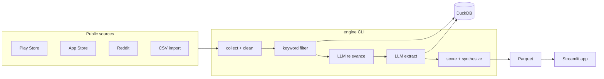

# Google Photos — Vague-Memory Retrieval Discovery Engine

Assignment project: discover **where and why** users fail to retrieve photos from **incomplete memory**, using public feedback and structured LLM extraction.

## Two interfaces

| Interface | Purpose |
|---|---|
| **`py -3 -m src.web_app`** | **Main UI** — live web scrape + taxonomy analysis (no DuckDB required) |
| **`py -3 -m engine`** | Optional offline CLI (`collect` → DuckDB) if you want a stored corpus |

## Quick start

```powershell
cd "d:\PM\Discovery Engine"
py -3 -m pip install -r requirements.txt
copy .env.example .env   # add OPENROUTER_API_KEY or OPENAI_API_KEY

py -3 -m engine --help
py -3 -m engine llm-test
py -3 -m engine collect --yes

py -3 -m src.web_app     # browser UI on http://127.0.0.1:8765
```

The web UI **does not use DuckDB** — each search crawls public sources live. Optional: `py -3 -m engine collect --yes` for offline bulk import (see `config.yaml`).

## Architecture (target)



## Docs

- `DECISIONS.md` — gap audit vs assignment master prompt  
- `METHODOLOGY.md` — sources, coding scheme, validation status  
- `config.yaml` — sources, keywords, models, scoring weights  

## Assignment research questions

See `data/research_questions.json` and the landing page in the web UI.
